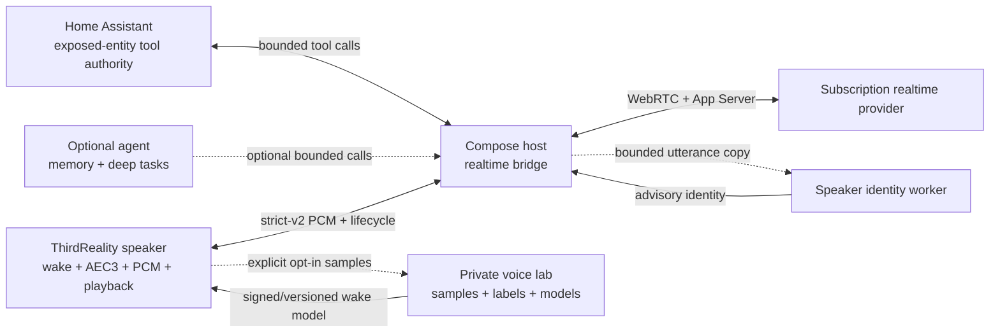

# Advanced independent realtime voice plan

## Decision

Extend the server-offloaded realtime assistant with four independent features:

1. Home Assistant tools exposed to native realtime conversations by default;
2. an optional external agent for memory and deeper tasks;
3. personalized wake-word training and correction; and
4. optional speaker identification.

Home Assistant Conversation, STT, and TTS packaging is explicitly excluded.
Home Assistant participates only as the authenticated smart-home tool authority.
The realtime session remains the product: the ThirdReality speaker is a small
audio appliance and the Docker Compose host owns training, identity, tool
authority, model artifacts, and diagnostics.

No feature in this plan may make the current conversation path slower merely by
being installed. Collection and training are disabled by default. Wake inference
must stay local. Speaker identification is asynchronous and advisory, and tool
metadata is captured before provider startup rather than queried in the audio
loop.

## Performance invariants

- The default configuration allocates no sample writer, embedding model, or
  additional audio queue.
- Dataset management and model training are separate commands, never imports of
  the bridge or speaker runtime.
- Opt-in sample capture performs one bounded queue handoff; file I/O and hashing
  happen on the host, not the microphone callback.
- A personalized wake model replaces the selected wake detector after
  qualification. It does not permanently run a second detector in parallel.
- Speaker identification never gates wake acknowledgement, provider readiness,
  capture opening, interruption, or the first response. Its result may annotate
  later context only if it arrives in time.
- Home Assistant tool discovery is generation-scoped and complete before
  `thread/start`. The broker adds no audio-loop work.
- Tool execution is asynchronous and cannot block PCM forwarding.
- The optional agent is absent from prompts and network traffic unless
  configured. It never owns Home Assistant entity control.
- The existing per-session report remains an on-demand CLI and adds zero runtime
  work.

## Privacy and trust model

Voice recordings are more sensitive than transcripts. The voice lab therefore:

- has no implicit storage location and must be initialized deliberately;
- requires explicit consent on every import or future capture command;
- stores directories as mode `0700` and files as mode `0600`;
- records content hashes, provenance, labels, and model versions;
- supports deterministic verification and deletion by sample ID;
- never commits recordings, embeddings, identities, or trained models to Git;
- does not upload recordings to the provider for training; and
- treats a speaker match as advisory, never as authentication for dangerous
  actions.

An identity can personalize names, language, or low-risk preferences. Locks,
alarms, purchases, account changes, and other consequential actions still need
the automation authority's own policy and confirmation.

## Shared voice-lab data model

The first implementation uses a small, dependency-free local dataset rather
than introducing a database into the bridge. Each immutable WAV sample has:

- a SHA-256 sample ID and source hash;
- mono PCM16, 16 kHz format metadata and measured duration/peak/RMS;
- one kind: `wake-positive`, `wake-negative`, `speaker-enrollment`, or
  `background`;
- an optional stable speaker ID;
- an optional expected wake phrase;
- a detector outcome: `hit`, `miss`, `false-activation`, or `not-evaluated`;
- capture provenance and a UTC import timestamp; and
- a sidecar JSON record stored next to the private WAV file.

`wake-positive` means the phrase is actually present, regardless of whether the
current detector found it. A missed detection is therefore a positive sample
with outcome `miss`. `wake-negative` and `background` samples must not contain
the target phrase. This distinction prevents failed detections from being
mistakenly trained as negatives.

## Milestones

### M0 — private dataset and diagnostics foundation

Status: implemented.

- Keep the per-session reporter entirely on demand.
- Add a `voice_lab.py` CLI to initialize, import, list, verify, and remove
  consented PCM WAV samples.
- Reject malformed, oversized, implausibly short/long, duplicate, or
  label-inconsistent imports.
- Produce stable machine-readable JSON so later trainers do not parse filenames.

Exit gate: focused tests prove validation, permissions, duplicate handling,
verification, deletion, and no import from either runtime.

### M1 — default Home Assistant tool authority

Status: implemented; physical entity-control canary pending.

- Reuse the authenticated Home Assistant LLM API broker and its selected
  exposed-entity policy. Do not add another Home Assistant token or a second
  entity allowlist to the bridge.
- Make the first/default Conversation subentry the realtime tool authority on
  new installations and migrate existing entries to one deterministic authority.
- Capture one immutable authority snapshot before every native `thread/start`,
  merge it with bridge-owned `end_conversation`, and preserve it through
  provider rollover.
- Execute calls asynchronously through Home Assistant-owned tool objects, with
  bounded schemas, timeouts, deduplication, exactly-once results, and
  fail-closed unknown outcomes.
- Keep tool schemas and results off the device PCM socket.

Exit gate: native voice can read and control exposed entities during a long
session and after interruption while audio keeps flowing during tool calls;
authority loss fails closed and no ambiguous action is retried.

### M2 — optional external agent interactivity

Status: synchronous recall/deep-task adapter and active-session report-back
implemented; physical agent canary pending.

Follow the useful split in
[`voicepe-realtime`](https://github.com/TristanBrotherton/voicepe-realtime):
Home Assistant remains the built-in smart-home integration, while an external
agent is optional and handles memory or deeper cross-application work.

- Add disabled-by-default `ask_agent` and `recall_memory` tools using a bounded
  HTTP adapter compatible with the reference project's `question`/`room` and
  `recall` request shapes.
- Agent-owned names take precedence over colliding Home Assistant tool names,
  but the system prompt directs all entity control to Home Assistant.
- Require an explicit URL; support an optional bearer token; bound request and
  response sizes and keep timeouts below App Server's tool deadline.
- Do not grant the agent shell, OAuth, Home Assistant credentials, or an
  implicit route to execute smart-home actions.
- Deliver asynchronous report-back through its own route-scoped bearer and a
  bounded active-session channel; never reopen a closed session unexpectedly.

Exit gate: no agent configuration means no advertised tools or runtime work;
when configured, recall and deep-task calls return exactly once without delaying
PCM or shadowing Home Assistant control.

### M3 — explicit sample capture and labeling

- Add a disabled-by-default speaker-to-host sample channel separate from the
  realtime media socket.
- Accepted wake capture: retain a bounded pre-wake window and short post-wake
  tail, then enqueue it after the realtime owner is established.
- Failed wake correction: a local CLI/UI action labels the most recent bounded
  near-wake buffer as `wake-positive` with outcome `miss`. Do not infer a miss
  merely from a high model score.
- False activation correction: label only after an explicit tester action.
- Add content-free counters to the session reporter; never log sample audio or
  paths by default.

Exit gate: collection disabled has no measurable callback cost; enabled capture
does not change wake-to-ready p95 by more than 10 ms and cannot block capture.

### M4 — personalized wake model

Status: compatible one-model activation path implemented; training and physical
qualification pending.

- Train on the Compose host from owner positives, room-specific negatives, and
  augmentation for distance, noise, reverberation, and speaker playback.
- Split by recording session, not random clip, so evaluation cannot leak nearly
  identical audio into train and test sets.
- Export the format supported by the device's wake runtime, with artifact hash,
  training manifest hash, thresholds, metrics, and rollback parent.
- Evaluate false rejects at 0.5 m, 1.5 m, and 3 m plus false activations during
  music, assistant playback, television, and unrelated Spanish/English speech.
- Run a short explicit shadow canary only during testing. Promote one detector
  atomically and remove the shadow evaluator afterward.
- Activate a qualified artifact through `personalized_wake_config_path`. The
  pinned firmware's `pymicro_wakeword.MicroWakeWord.from_config` loader accepts
  the same ESPHome microWakeWord JSON/TFLite format already used by Okay Nabu.
  The overlay requires the custom phrase to match the configured phrase, keeps
  the vendor detector's stable ID, and replaces rather than adds a detector.
- Failed attempts improve the next trained version; they never mutate the live
  model online.

Exit gate: 20/20 intended wakes at 1.5 m in the target room, no false activation
in a two-hour playback/noise test, and wake callback CPU no worse than the
qualified vendor detector.

### M5 — speaker enrollment and identification

- Enroll each person from several sessions and distances, not one phrase.
- Compute embeddings on the Compose host from AEC-cleaned user speech after wake.
- Compare against a small closed-set profile store with calibrated accept and
  reject thresholds; return `unknown` when confidence or margin is insufficient.
- Aggregate across multiple speech regions in a session and allow identity to
  stabilize rather than oscillate on every frame.
- Inject an advisory identity context update only after a confident result. Do
  not restart the provider or delay its first response.
- Add an explicit profile delete/re-enroll workflow and threshold evaluation for
  household members, visitors, playback, and recordings.

Exit gate: target household validation meets the documented false-accept bound,
unknown speakers remain unknown, and identification work causes no audio queue
growth or response-start regression.

### M6 — deployment and burn-in

- Package the voice lab and future trainer/identity worker in Docker Compose
  profiles so the ordinary bridge image stays small.
- Persist private artifacts in a dedicated owner-only host directory, never the
  OAuth mount.
- Add health fields for model version, identity readiness, collection state, and
  tool-authority generation without personal content.
- Run the physical matrix at full speaker volume and 1.5 m: first wake,
  multi-turn, interruption, repeated interruption, terminal phrases, volume
  changes, background noise, bridge restart, and device reboot.

## Development loop

Use focused tests while iterating:

1. tests for the changed module;
2. Ruff check/format for changed Python files;
3. one protocol or physical canary for the changed common path; and
4. the broader suite only before a release or when a shared protocol primitive
   changes.

The repository's large suite remains valuable as a release gate, but it is not
the inner development loop. New tests should cover observable contracts and
common failure modes, not every theoretical interleaving.

## Explicit non-goals

- Repackaging the subscription backend as Home Assistant Conversation, STT, or
  TTS entities. Home Assistant tool exposure is intentionally independent of
  those Assist pipeline entities.
- Letting the optional external agent replace or bypass Home Assistant's
  exposed-entity policy.
- Treating voice identity as secure biometric authentication.
- Continuous recording or passive household surveillance.
- Unattended online wake-model mutation.
- Running heavy training or embedding inference on the ThirdReality speaker.
- Replacing the working native realtime conversation with a turn-based Assist
  pipeline.
