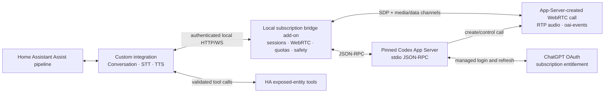

# Home Assistant ChatGPT Subscription Voice Integration Plan

## Decision

Build this as a hybrid Home Assistant custom integration plus a local companion add-on:

- The custom integration exposes standard Home Assistant Conversation, STT, and TTS entities.
- The add-on runs a pinned `codex app-server` process, owns its JSON-RPC connection, and terminates the WebRTC media session used by subscription-backed voice.
- Codex owns the ChatGPT browser/device-code OAuth flow, token persistence, and refresh.
- All model traffic in subscription mode goes through the ChatGPT-authenticated Codex process. The integration never treats the OAuth token as a general OpenAI API key and never calls private ChatGPT endpoints itself.
- There is no silent fallback to a separately billed Platform API key.

This is technically viable as an **experimental local Codex client**. ChatGPT sign-in for subscription access is an officially documented Codex authentication mode, and App Server exposes managed browser and device-code login. The STT/TTS compatibility layer relies on the experimental `thread/realtime/*` WebRTC surface, so the Codex version, generated protocol schema, and media behavior must be pinned and tested. See [Codex authentication](https://learn.chatgpt.com/docs/auth) and the [Codex App Server protocol](https://github.com/openai/codex/blob/rust-v0.146.0/codex-rs/app-server/README.md).

In the researched App Server version, managed ChatGPT authentication works through the WebRTC call-creation path. Its raw realtime WebSocket path still requires API-key authentication. Therefore, subscription mode must create a genuine WebRTC offer with an audio track/transceiver and the `oai-events` data channel; it cannot implement voice by sending PCM only through JSON-RPC. See the pinned [realtime conversation source](https://github.com/openai/codex/blob/rust-v0.146.0/codex-rs/core/src/realtime_conversation.rs).

Home Assistant already includes an OpenAI integration with Conversation, STT, and TTS subentries, but it requires a paid Platform API key. This project exists specifically to add the local ChatGPT-subscription/App-Server path. See the [official Home Assistant OpenAI integration](https://www.home-assistant.io/integrations/openai_conversation/).

## Architecture



The add-on is the trust boundary. It must not mount the Home Assistant configuration directory, Docker socket, SSH keys, or unrelated host workspaces. Codex threads run in an empty, read-only workspace; Home Assistant control is provided only through explicit dynamic tools.

## Home Assistant-to-Codex mapping

| Home Assistant surface | HA contract | Codex App Server mapping | Maturity |
|---|---|---|---|
| Conversation agent | `ConversationEntity._async_handle_message(...)` with `ChatLog` | `thread/start`/`thread/resume`, `turn/start`, streamed agent messages; map selected HA LLM tools to App Server dynamic tools | Thread lifecycle is supported; dynamic tools are experimental |
| Speech-to-text | `SpeechToTextEntity.async_process_audio_stream(...)` | Feed HA audio into the WebRTC microphone track and harvest final user transcript events from the conversational session | Experimental compatibility adapter, not a dedicated transcription API; response suppression and correlation must be proven |
| Text-to-speech | `TextToSpeechEntity.async_get_tts_audio(...)`, followed by streaming support | Send `thread/realtime/appendSpeech`, receive/decode the WebRTC remote audio track, and package it as a HA-supported format | Experimental compatibility adapter, not the public Speech API; exact-text behavior must be proven |
| Authentication | Config flow backed by the add-on | `account/login/start` with `chatgptDeviceCode` or `chatgpt`; observe `account/login/completed` and `account/updated` | Managed ChatGPT auth is documented by App Server |
| Quota diagnostics | Integration diagnostics/options UI | `account/rateLimits/read`, `account/rateLimits/updated`, and `account/usage/read` where available | Report only fields actually supplied by the active account |

The three relevant Home Assistant entity contracts are documented in [Conversation](https://developers.home-assistant.io/docs/core/entity/conversation/), [Speech-to-text](https://developers.home-assistant.io/docs/core/entity/stt/), and [Text-to-speech](https://developers.home-assistant.io/docs/core/entity/tts/).

## Phase 0: subscription feasibility harness

Complete this before building the integration UI.

1. Pin an exact Codex CLI/App Server build and check its generated JSON schemas into test fixtures.
2. Launch App Server over stdio and initialize it with `capabilities.experimentalApi = true`.
3. Enable the `realtime_conversation` feature for the isolated add-on configuration.
4. Complete `chatgptDeviceCode` login and verify `account/read` reports `authMode: chatgpt` and the expected plan/workspace.
5. Record the available quota snapshot before and after each probe.
6. Construct a real WebRTC peer in the add-on: create an audio track/transceiver and `oai-events` data channel, generate the offer, pass it to `thread/realtime/start` with `transport.type = "webrtc"`, apply the returned SDP answer, and verify media flow.
7. Prove these independent loops without an API key:
   - Text input produces a conversation response.
   - PCM sent over the WebRTC microphone track produces a correctly correlated final user transcript.
   - `appendSpeech` produces playable audio on the remote WebRTC media track without changing its wording.
   - A transcript-only operation can suppress, mute, or discard the conversational response without leaking playback into HA.
8. Restart App Server and prove that Codex refreshes/reuses the managed login without copying tokens into Home Assistant.

Go/no-go criteria:

- No Platform API key is present.
- The account accepts the three operations under ChatGPT authentication.
- Usage is attributable to the expected ChatGPT entitlement or reported quota.
- STT can be isolated from unwanted assistant playback and transcripts can be correlated safely for the supported concurrency level.
- TTS speaks supplied text faithfully enough for announcements and Assist replies.
- The protocol remains usable after a controlled App Server restart.

If any of those fail, subscription-only STT/TTS is not shippable with the selected Codex version. The official API-key integration may be offered as an explicit alternative, but it must never activate automatically.

## Implementation phases

### 1. Subscription bridge add-on

- Supervise one pinned `codex app-server` child process over stdio.
- Implement typed JSON-RPC request correlation, notification routing, cancellation, timeouts, and schema-version checks.
- Own the WebRTC peer, SDP exchange, `oai-events` data channel, input audio track, remote audio track, resampling, jitter buffering, and media cancellation. Evaluate `aiortc` in the feasibility harness; use a small Rust/GStreamer media worker if it cannot meet stability or resource targets.
- Expose a narrow authenticated local API to the HA component: login, logout, account status, conversation turn, transcribe stream, synthesize stream, cancel, and diagnostics.
- Use App Server's managed device-code/browser login. Store the Codex credential cache only in the add-on's private persistent volume with restrictive permissions or a supported credential store.
- Reject arbitrary Codex command execution, filesystem requests, external MCP configuration, and approval prompts at the bridge boundary.
- Add bounded queues and one active speech operation per configured account initially. The first release must serialize STT and TTS because transcript events are ephemeral and do not provide a robust standalone-STT correlation contract.

Exit gate: the bridge survives App Server crashes, reports a useful reauthentication state, and never returns tokens through its API or diagnostics.

### 2. Home Assistant integration scaffold

Use a unique domain such as `chatgpt_subscription_voice`; do not override Home Assistant's `openai_conversation` integration.

- Create one parent `ConfigEntry` for the local bridge/account.
- Add separate config subentries for `conversation`, `stt`, and `tts` so users can create multiple model/voice profiles.
- Implement config, reauthentication, reconfiguration, options, migration, and unload flows.
- Store connection material in `ConfigEntry.data`; store model, prompt, language, voice, and tool choices in subentry options.
- Validate the local bridge and authenticated account during setup.
- Provide redacted diagnostics with App Server version, protocol compatibility, auth mode, plan type, feature availability, and rate-limit fields.

Exit gate: all three providers appear as selectable Assist pipeline components and reload cleanly without restarting HA.

### 3. Conversation agent and Home Assistant tools

- Implement `ConversationEntity` with streaming `ChatLog` support and conversation-ID-to-Codex-thread mapping.
- Start every thread in an empty read-only working directory, with no host mounts and no unattended execution approvals.
- Call `chat_log.async_provide_llm_data(...)` to obtain the selected Home Assistant LLM API and exposed-entity tools.
- Convert those tools to App Server `dynamicTools`. Route `item/tool/call` requests back through Home Assistant's validated tool layer, then return only JSON-serializable results.
- Set `ConversationEntityFeature.CONTROL` only when an HA LLM API is selected.
- Cap tool iterations and response length; handle cancellation, rate limits, failed tools, and stale threads.
- Persist only the minimal HA-conversation-to-thread mapping needed for resume. Do not persist raw speech.

Home Assistant's built-in LLM API restricts control to user-exposed capabilities and excludes administrative operations; preserve that boundary. See the [Home Assistant LLM API](https://developers.home-assistant.io/docs/core/llm/).

Exit gate: multi-turn text conversation works, only exposed entities are visible, and failed or unauthorized tool calls cannot escape the add-on sandbox.

### 4. Speech-to-text entity

- Advertise only the audio metadata combinations verified by the bridge.
- Convert HA's incoming audio stream to the WebRTC microphone track's negotiated format without unbounded buffering.
- Start or borrow an ephemeral WebRTC realtime conversation with startup context disabled and its output locally muted for transcription-only calls.
- Collect only the final transcript whose role is `user`; serialize requests until the pinned protocol provides reliable item-level correlation.
- Stop and destroy the realtime session immediately after success, timeout, cancellation, or error.
- Return standard `SpeechResult` success/error states without logging audio or transcript contents by default.

Exit gate: empty input, multiple languages, long utterances, cancellation, rate limiting, and App Server restart all produce bounded and valid HA results.

### 5. Text-to-speech entity

- Populate voice choices dynamically through `thread/realtime/listVoices` rather than hard-coding the list.
- Implement one-shot `async_get_tts_audio` first by collecting decoded frames from the WebRTC remote media track, buffering bounded PCM, and returning a valid WAV payload.
- Add `async_stream_tts_audio` once audio framing and player compatibility are proven.
- Forward user-selected voice and style instructions only when supported by the pinned protocol.
- Flush output promptly on cancellation and apply backpressure when a media player consumes audio slowly.
- Disclose in documentation and setup that the voice is AI-generated.

Exit gate: `tts.speak` works on common HA media players and voice satellites, audio starts within the agreed latency target, and cancel/restart never leaves a stuck session.

### 6. Assist pipeline, reliability, and release

- Test a complete `STT → conversation → TTS` pipeline and follow-up conversations.
- Preserve the distinction between staged Assist and true duplex voice: this component supplies the three standard providers but does not, by itself, add barge-in or simultaneous listen/speak.
- Add authentication expiry, quota exhaustion, network loss, App Server upgrade, and HA restart tests.
- Package the custom integration for HACS and the add-on as a separate Home Assistant add-on repository. Provide a standalone container for Home Assistant Container/Core installations that cannot install Supervisor add-ons.
- Document the pinned version upgrade procedure: generate schemas, run contract tests, run the three subscription probes, then promote the new version.

Exit gate: a one-week pilot completes without credential leakage, unbounded storage, thread loss, or silent API-billed fallback.

## Proposed repository layout

```text
custom_components/
  chatgpt_subscription_voice/
    __init__.py
    manifest.json
    const.py
    config_flow.py
    coordinator.py
    conversation.py
    stt.py
    tts.py
    diagnostics.py
    translations/
      en.json
addon/
  chatgpt_subscription_voice/
    config.yaml
    Dockerfile
    rootfs/
bridge/
  app_server.py
  jsonrpc.py
  auth.py
  sessions.py
  conversation.py
  audio.py
  quota.py
protocol/
  schemas/
tests/
  component/
  bridge/
  contract/
  audio/
  integration/
docs/
  architecture.md
  security.md
  installation.md
  upgrading-codex.md
hacs.json
README.md
```

## Required test matrix

- OAuth: device-code success, cancel, expiry, logout, account/workspace mismatch, reauthentication, and restart persistence.
- Protocol/media: pinned-schema validation, unknown notification handling, request timeout, child crash, incompatible version refusal, SDP/ICE failure, data-channel loss, RTP jitter, codec mismatch, resampling, and proof that subscription mode never selects the API-key-only raw WebSocket path.
- Conversation: streaming, multi-turn resume, tool success/failure, exposed-entity filtering, iteration limit, cancellation, and quota exhaustion.
- STT: all advertised metadata, multi-frame WebRTC input, empty transcript, tail flushing, unwanted-response muting, language handling, long input, cancellation, and concurrency rejection.
- TTS: exact text, voice selection, remote-track decoding, valid WAV framing, incremental audio, slow consumer, cancellation, and media-player retrieval.
- Security: no credential in HA state/logs/diagnostics, no arbitrary RPC proxy, no host mounts, no unauthorised tool, and no API-key fallback.
- End-to-end: Assist event order, one satellite pilot, HA/App Server restarts, and before/after subscription quota observations.

## Delivery estimate

After Phase 0 passes, expect approximately 3–4 engineering weeks for an experienced Home Assistant/Python developer:

- Feasibility harness: 2–3 days
- Add-on and protocol client: 4–6 days
- HA config/subentry lifecycle: 2–3 days
- Conversation and HA tools: 4–6 days
- STT and TTS: 5–7 days
- Reliability, packaging, and pilot: 4–6 days

The principal risk is not Home Assistant integration work; it is adapting a version-coupled conversational WebRTC surface into two standalone provider contracts that it was not explicitly designed to serve. Phase 0 must remain a hard gate.
