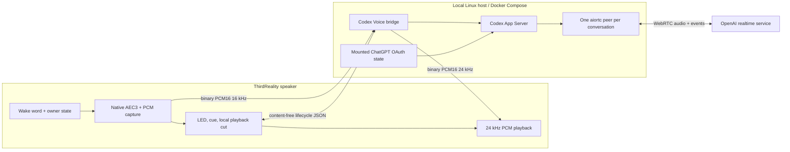
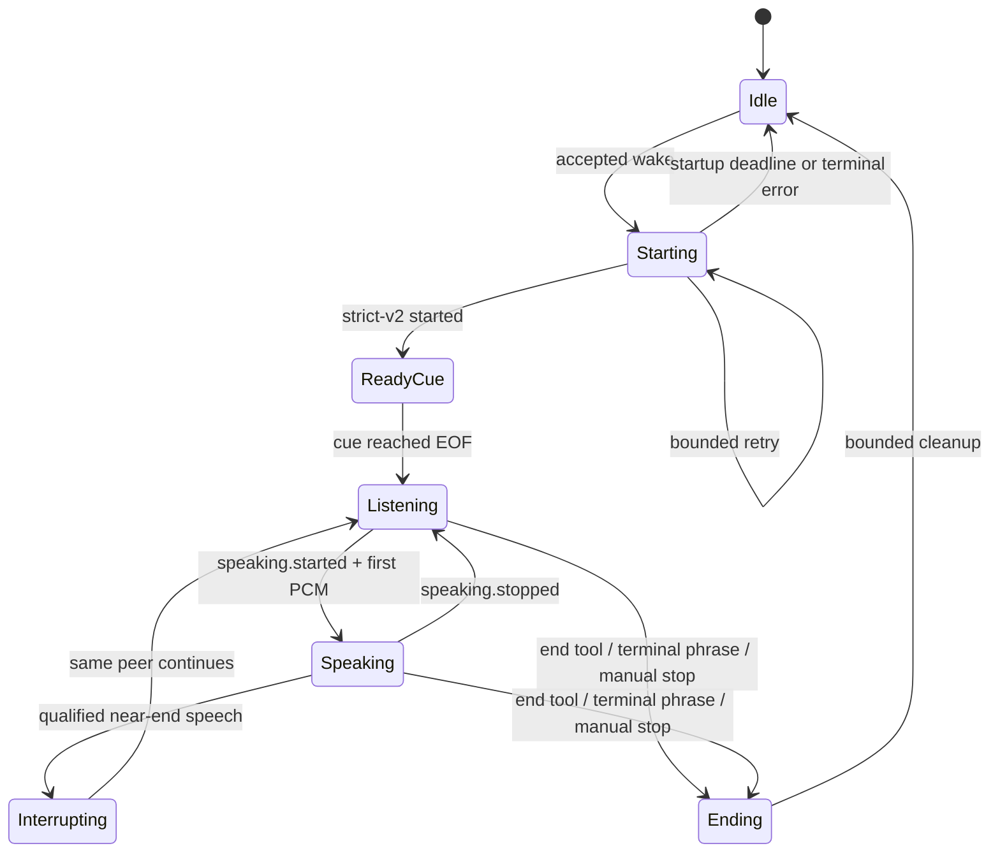

# Server-offloaded realtime voice architecture

## Decision

Make the ThirdReality speaker a small, deterministic audio appliance and move
the resource-heavy realtime client to a local Linux server. The active LAN
transport is strict realtime wire v2 with `media_transport: "bridge_pcm"`,
`conversation_mode: "native"`, full duplex, and the device's native AEC3
capture backend. The existing device-owned WebRTC and Home Assistant paths
remain in the repository, but neither participates in this first deployment.

This is a boundary change, not a turn-based imitation of realtime voice. One
server-owned WebRTC peer remains open for the conversation. Microphone audio
flows continuously, provider audio streams back immediately, and the user can
interrupt without starting a replacement peer.



The LAN load while both directions are active is approximately 32 KB/s for
16 kHz microphone PCM plus 48 KB/s for 24 kHz output PCM, excluding WebSocket
overhead.

## Responsibility split

### Speaker

The speaker owns only work that must be physically local:

- vendor wake-word detection and exclusive microphone ownership;
- deterministic LED and confirmation-cue behavior;
- sample-aligned native AEC3 using the physical render reference;
- 16 kHz mono PCM16 capture and bounded WebSocket framing;
- 24 kHz mono PCM16 playback, output-epoch fencing, and dynamic volume;
- immediate local playback termination on qualified near-end speech; and
- manual stop, mute, disconnect, and session-timeout cleanup.

It does not run `aiortc`, create SDP, hold OAuth state, manage provider threads,
prewarm peer workers, call Home Assistant, or interpret general tools.

### Local server

The Compose service owns the stateful and memory-intensive work:

- the authenticated strict-v2 `/v1/realtime` WebSocket;
- Codex App Server and the existing file-backed ChatGPT login;
- exactly one native realtime thread and one `aiortc` peer per conversation;
- stateful 16-to-24 kHz microphone resampling and paced RTP input;
- provider VAD, response lifecycle, cancellation, and output epochs;
- the sole `end_conversation` tool and an exact bilingual terminal-phrase
  fallback; and
- bounded cleanup of the WebRTC peer and every thread owned by the session.

Home Assistant, Hermes, finite STT, finite TTS, transcript executors, and home
control are explicitly out of this path. They can be reintroduced later as a
separate tool authority after the conversation experience passes its physical
acceptance matrix.

## Deterministic session lifecycle

One accepted wake creates one owner generation. Every asynchronous callback is
generation-checked so a stale failure, cue completion, or socket close cannot
change the LED or capture state of a newer session.



The concrete startup contract is:

1. An accepted wake pulses the LED, claims the microphone once, discards the
   wake tail, and enters `Starting`. User audio is not admitted yet.
2. The device opens one strict-v2 socket and sends the fixed native start
   contract. Startup may retry at most three times inside one 12-second owner
   deadline; retries never create overlapping owners.
3. The server creates the thread and WebRTC peer, waits for provider transport
   readiness, and only then sends `started`.
4. The speaker plays the pinned acknowledgement cue. `started` alone does not
   open capture to the provider.
5. Cue EOF changes the LED to steady listening and atomically admits live
   capture. Audio from before that boundary is never replayed as a command.
6. Any startup failure returns to a known idle LED/capture state. Realtime-only
   mode never falls through to a Home Assistant single-turn request.

Normal provider delays do not end the conversation. Only an explicit end,
manual stop, disconnect, hard session limit, or terminal transport error does.

## Full-duplex audio and interruption

Native AEC3 remains on the speaker because its microphone and physical render
reference are sample-aligned there. Moving AEC to the server would add LAN
jitter before cancellation and would make changing speaker volume harder to
model. The capture gain is applied only after echo cancellation and before the
PCM is sent to the host; saturation is bounded to signed PCM16.

Playback fixes the sink and relative stream at a 100% physical anchor.
User-facing volume changes are applied in one non-amplifying software
attenuation stage: 0 is mute and 1–100% is audible. A saved initial deployment
level may be 80%, while the physical buttons remain able to reach full hardware
output. The reference deployment must pass its physical canary at the 100%
worst case and exercise representative attenuated levels.

During provider speech the microphone never closes. Qualified near-end speech
immediately kills and flushes local playback, fences all late PCM from that
output epoch, and continues sending the interrupting samples on the same LAN
socket. Nothing replays or renegotiates. Provider VAD then cancels the active
response and consumes that same utterance. This specifically preserves the
words that caused the interruption instead of waiting for a later sentence.

The device must not use simple microphone energy as its only barge-in signal:
the decision is made from AEC-filtered near-end speech with a short consecutive
frame requirement. Provider `speech_started` remains an independent reinforcing
cut. A local cut alone never claims remote cancellation.

## Ending a conversation

The native thread exposes exactly one empty-input tool, `end_conversation`.
Its Spanish and English instructions say to call it when the user clearly asks
to end the conversation, including “terminar” and “terminar llamada”. The
server accepts only that tool name and an empty object, emits a terminal
`stopped` lifecycle event, and closes the owned session.

An exact, normalized bilingual transcript allowlist is a narrow reliability
fallback for provider runs that acknowledge the phrase without calling the
tool. It is not a general intent parser. All Home Assistant tools remain absent.

## Server warming policy

Compose keeps the bridge, Codex App Server process, OAuth state, Python media
stack, and route listener warm continuously. That removes device-side imports,
worker creation, and memory pressure from wake latency.

Milestone 1 still creates the provider thread and WebRTC peer after an accepted
wake. A permanently connected provider “warm slot” is deferred until metrics
show that remote negotiation dominates warm wake latency. A connected slot
consumes a live provider session, needs expiry rotation, and adds assignment
and cleanup states; caching a local offer without completing the remote
negotiation would not remove the expensive part. If added later, it must be a
single opt-in server slot and must never receive device audio before assignment.

## Docker Compose deployment

The root [`compose.yaml`](compose.yaml) builds
[`deploy/docker/Dockerfile`](deploy/docker/Dockerfile) with:

- Codex CLI 0.147.0, an exact Python dependency resolution, and a pinned Node
  base-image digest;
- a non-root UID/GID matching the owner of the host `auth.json`;
- a read-only root filesystem, bounded no-exec tmpfs, all capabilities dropped,
  `no-new-privileges`, an init process, a PID limit, and bounded log rotation;
- an authenticated health check that requires a running App Server using
  `chatgpt` auth; and
- Linux host networking so the server-owned WebRTC peer does not cross Docker
  NAT. The bridge port must therefore be limited to the trusted LAN by the host
  firewall.

Only the single existing `auth.json` file is bind-mounted. It remains mode 0600
and read/write because Codex must refresh managed OAuth state in place; the
whole Codex home is never mounted. The container UID must equal the file owner.
The mount's parent is root-owned and traverse-only so an arbitrary matching
UID can reach the file without making the directory listable. Compose also
overrides any host-specific `HA_CODEX_BINARY` inherited from the runtime
environment with the image's `/usr/local/bin/codex` and retains the qualified
0.5-second live-fragment setting. It also clears host-specific command and
working-directory overrides and supplies a fixed container `PATH`, leaving the
bridge to create its normal private temporary working directory.
The primary Home Assistant bearer and the distinct route-scoped device bearer
live in a separate ignored mode-0600 environment file. Never put either token
in the committed Compose control file or in device logs.

Initial setup:

```bash
mkdir -p .codex-voice
cp deploy/docker/compose.env.example .codex-voice/compose.env
cp deploy/docker/bridge.env.example .codex-voice/bridge.env
chmod 600 .codex-voice/compose.env .codex-voice/bridge.env
```

Set the absolute auth path, its numeric owner UID/GID, and two independent
random bearer tokens. Then build and start:

```bash
docker compose --env-file .codex-voice/compose.env up --detach --build
docker compose --env-file .codex-voice/compose.env ps
```

`docker compose config` expands the runtime environment file and can display
its bearer values; do not paste that output into tickets or logs.

## Content-free observability

The bridge and device should record monotonic durations and counters, never
audio, prompts, transcripts, SDP, bearer values, tool arguments, or OAuth
state. The acceptance log needs:

- wake accepted to socket open, provider ready, cue start, cue EOF, and first
  response audio;
- startup attempt count and terminal phase;
- microphone, LAN-send, RTP-input, provider-output, and playback queue
  high-water marks;
- speaking epoch, local barge-in cut, provider speech-start, cancellation, and
  next user-turn timing;
- session duration, end reason, thread cleanup outcome, device RSS, server RSS,
  and unexpected process restart/OOM counts; and
- AEC health and level summaries sufficient to distinguish echo from near-end
  speech without retaining content.

Use a random per-session correlation value that cannot be used to recover the
conversation or a credential.

## Rollout and rollback

1. Build the Compose image and verify configuration, imports, CLI version,
   owner-only OAuth mount, and authenticated health without changing the
   device.
2. Run the container on an unused canary port, complete a synthetic v2 socket
   check, and confirm server WebRTC connectivity.
3. Deploy the full-duplex `bridge_pcm` device configuration atomically. Restart
   only the vendor voice service; never disable ADB TCP and never restart or
   kill PulseAudio.
4. Run the physical matrix below at the fixed 100% anchor, including the
   representative software levels listed below, followed by a long soak.
   Promote the Compose port only after it passes.
5. Keep the existing system service and device-owned WebRTC code intact until
   the new path has passed repeated cold boot and soak tests.

Rollback is configuration-only: stop the Compose bridge, restore the previous
bridge service/port and device media transport, restart only the vendor voice
service, and verify idle LED/capture ownership. No firmware change or OAuth
copy is involved.

## Completion gates

The architecture is complete only when all of these pass on the physical
ThirdReality unit, not merely in mocked tests:

- 20 consecutive quiet-room wakes at 1.5 m reach either the ready cue or a
  clean idle failure within 12 seconds; no LED remains stuck and at least 19
  reach ready on the first wake phrase;
- warm wake-to-ready-cue p95 is at most 3 seconds, measured separately from
  provider first-response latency;
- 20 commands spoken after cue EOF are admitted without requiring a second
  sentence;
- one continuous 10-minute conversation has no spontaneous close, process
  restart, OOM, response truncation, or audible crackle;
- at 100% output, 20 assistant replies produce no self-interruption, and mute
  plus 1, 25, 60, 80, and 100% physical-button levels all produce the expected
  non-amplifying software level without moving the anchor;
- 20 deliberate interruptions cut playback within 250 ms p95, retain the words
  that caused the cut, and produce the replacement response without a fresh
  WebRTC negotiation;
- “terminar” and “terminar llamada” each end 10 sessions within one second,
  with the LED and microphone returning to idle; and
- disconnect, server restart, and startup-failure drills always converge to
  idle and a later wake succeeds without rebooting the speaker.

Automated gates cover strict-v2 framing, state transitions, retry ownership,
PCM gain/saturation, output-epoch fencing, same-peer barge-in, end-tool/fallback
behavior, cleanup, Compose parsing, image build, non-root imports, and secure
OAuth mounting. A green automated suite is necessary but does not replace the
physical matrix.

## Milestones

- **M1 — Server-offloaded native conversation:** Compose bridge, strict-v2
  binary media, one server peer, deterministic startup, native AEC3, 100%
  playback, same-peer interruption, and explicit end. Home Assistant is absent.
- **M2 — Measured latency work:** optimize only the largest measured latency
  segment. Trial one connected server warm slot only if provider negotiation is
  proven dominant and the quota/lifecycle cost is acceptable.
- **M3 — Optional tools:** expose a deliberately small Hermes or Home Assistant
  authority behind a separate policy boundary. It must not change the audio
  transport or reintroduce turn-based speech rendering.
