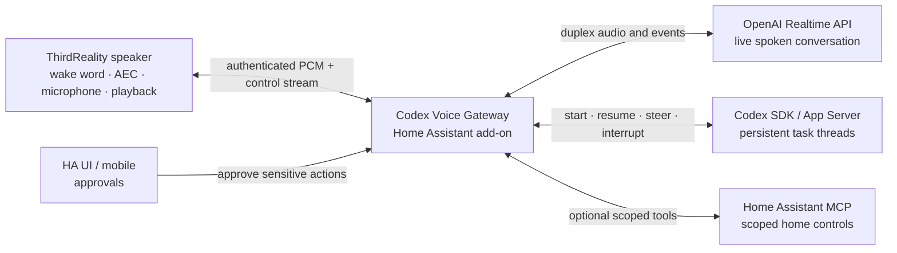

# ThirdReality Codex Realtime Conversation Plan

The right design is to reproduce Codex Desktop Voice's architecture, not its private endpoints:

1. A low-latency voice model owns the spoken conversation.
2. A persistent Codex thread performs longer coding work.
3. An explicit handoff layer starts, resumes, steers, or cancels Codex work and returns progress to the voice session.

That matches the documented Codex Voice behavior—GPT-Live manages the conversation while Codex threads handle longer tasks—and can be implemented with the supported Realtime API plus Codex SDK/App Server. See [Codex Voice](https://learn.chatgpt.com/docs/features/voice), [Realtime server controls](https://developers.openai.com/api/docs/guides/realtime-server-controls), and the [Codex SDK](https://learn.chatgpt.com/docs/codex-sdk).

This plan assumes the hardware is the ThirdReality Voice & Music Assistant Dev Edition.

## Target architecture



The OpenAI credentials, Codex runtime, thread state, and tool execution stay on the HA host. The 256 MB speaker remains an audio endpoint. See the [ThirdReality hardware specifications](https://www.thirdreality.com/products/voice-music-assistant-dev-edition).

## Implementation plan

| Phase | Work | Exit gate |
|---|---|---|
| 0. Hardware and security baseline | Back up a recoverable firmware image; measure CPU, memory, audio xruns, and Wi-Fi jitter; disable unauthenticated ADB on port 5555 and default-password SSH. | Device can be recovered, remote root access is closed, and baseline measurements are recorded. |
| 1. Host-side mechanism spike | Build the gateway with a Realtime session and a `delegate_to_codex` tool. Implement Codex thread start/resume/status/cancel using the SDK or stable App Server calls. Use simulated audio initially. | Spoken request can launch a persistent Codex task and receive a concise spoken result. |
| 2. Stock-firmware feasibility test | Use the existing HA/ESPHome satellite path to validate wake word, thread handoff, credentials, and UX. | Control-plane behavior works. This phase is explicitly not considered full-duplex acceptance. |
| 3. Realtime firmware audio path | Fork the ThirdReality firmware; add a post-AEC microphone tap, authenticated WSS transport to the gateway, streaming PCM playback, and shared audio-focus routing. Preserve stock HA and Sendspin behavior. | Simultaneous capture/playback works for 30 minutes with usable echo cancellation and bounded memory. |
| 4. Barge-in and task coordination | Keep microphone capture active during playback. On detected speech, immediately flush local audio and cancel the current spoken response. Do not cancel a running Codex task unless the user explicitly requests it. | User interruption silences playback within a target of 200 ms while background Codex work continues. |
| 5. Home Assistant integration | Package the gateway as an add-on; add configuration, diagnostics, device/session entities, task status, and approval notifications. Optionally expose scoped HA entities through the [HA MCP server](https://www.home-assistant.io/integrations/mcp_server). | Install, configure, inspect, approve, and recover the system through HA. |
| 6. Reliability and release | Add reconnect/resume, session expiry, queue limits, audio fault injection, API/CLI compatibility tests, OTA rollback, and operational documentation. | Wi-Fi and gateway restarts recover without losing the associated Codex thread. |

Estimated effort: roughly 3–5 engineering weeks for one engineer, with Phase 3's duplex/AEC test as the main feasibility gate.

## Firmware changes

Stock firmware cannot deliver desktop-style duplex voice by configuration alone: its current state machine is sequential and playback is URL-oriented. The production path therefore needs a narrow firmware extension. See the ThirdReality [`Satellite` state machine](https://github.com/thirdreality/voice-music-assistant/blob/aec2910db333f3f16e035583f83736441dc523ea/buildroot/package/thirdreality/linux-voice-assistant-cpp/src/satellite/Satellite.cpp#L408-L507).

Proposed additions:

- `CodexAudioBridge`: drains its own microphone ring continuously and maintains the authenticated gateway connection.
- `PcmStreamPlayer`: accepts incremental PCM frames and supports immediate `Flush`/`Stop`.
- `ConversationRouter`: arbitrates `Home Assistant | Codex | timer/announcement`, LED state, and Sendspin ducking.
- A dedicated tap through the existing `AudioCapture::AddTap`; the samples are already emitted after AEC/AGC/noise processing. See the [audio processing path](https://github.com/thirdreality/voice-music-assistant/blob/aec2910db333f3f16e035583f83736441dc523ea/buildroot/package/thirdreality/linux-voice-assistant-cpp/src/audio/AudioCapture.cpp#L324-L347).

Do not embed OpenAI authentication or Codex execution in the firmware.

## Gateway responsibilities

The HA-hosted gateway should implement:

- `delegate_to_codex(request, workspace)`
- `steer_codex(thread_id, instruction)`
- `get_codex_status(thread_id)`
- `cancel_codex(thread_id)`
- Persistent `device → voice session → Codex thread` mappings
- Concise progress summaries injected into the live voice conversation
- Separate semantics for "stop speaking" and "cancel the task"
- A UI/mobile approval broker for writes, commands, external network access, or home-control actions

Suggested greenfield layout:

```text
gateway/
  realtime/
  codex/
  handoff/
  device/
  state/
addon/
custom_components/codex_voice/
firmware/thirdreality/
protocol/
tests/
docs/
```

## Subscription-backed exact-fidelity option

When consuming a ChatGPT subscription is a requirement, the gateway can run Codex App Server and use its managed ChatGPT browser or device-code OAuth flow. Codex owns token storage and refresh; the gateway must never extract the OAuth token or treat it as a general OpenAI API key. This routes the client through ChatGPT-authenticated Codex rather than Platform API-key billing. See [Codex authentication](https://learn.chatgpt.com/docs/auth).

With the researched App Server version, the subscription-backed realtime path requires the gateway to own a genuine WebRTC peer: it creates an audio track and `oai-events` data channel, passes the SDP offer to `thread/realtime/start`, applies the returned answer, and relays media between that peer and the ThirdReality PCM stream. The raw realtime WebSocket path still expects API-key authentication. See the pinned [realtime conversation source](https://github.com/openai/codex/blob/rust-v0.146.0/codex-rs/core/src/realtime_conversation.rs).

The same pinned App Server can expose `thread/realtime/*` and its built-in Codex handoff behavior. Those voice methods require the experimental capability, are version-coupled to the Codex CLI schema, and emit ephemeral realtime events. Isolate them behind an adapter, pin an exact CLI release, and run subscription/quota and protocol contract tests before every upgrade. See the [Codex App Server realtime API](https://github.com/openai/codex/blob/main/codex-rs/app-server/README.md) and [OpenAI feature maturity](https://learn.chatgpt.com/docs/feature-maturity).

Deployment choice:

- Use the public Realtime API plus supported Codex thread APIs when stable Platform API contracts are more important than subscription billing.
- Use ChatGPT-authenticated App Server end to end when subscription consumption is required and the project accepts the experimental realtime compatibility burden.
