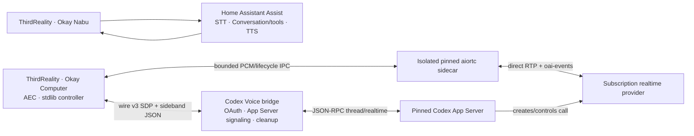

# ThirdReality Codex Realtime Conversation Plan

The right design is to reproduce Codex Desktop Voice's architecture, not its private endpoints:

1. A low-latency voice model owns the spoken conversation.
2. A persistent Codex thread performs longer coding work.
3. An explicit handoff layer starts, resumes, steers, or cancels Codex work and returns progress to the voice session.

That matches the documented Codex Voice behavior—GPT-Live manages the conversation while Codex threads handle longer tasks—and can be implemented with the supported Realtime API plus Codex SDK/App Server. See [Codex Voice](https://learn.chatgpt.com/docs/features/voice), [Realtime server controls](https://developers.openai.com/api/docs/guides/realtime-server-controls), and the [Codex SDK](https://learn.chatgpt.com/docs/codex-sdk).

This plan assumes the hardware is the ThirdReality Voice & Music Assistant Dev Edition.

## Implementation status (2026-08-10)

The repository now implements a narrower subscription-backed design than the
original greenfield plan:

- Okay Nabu remains the official Home Assistant Assist path and owns Home
  Assistant tools.
- Okay Computer is a separate native, tool-free path. It does not delegate to
  a coding thread or Home Assistant executor.
- The target speaker is Python 3.11 on aarch64 Buildroot Linux, not Android.
- Wire v3 carries authenticated SDP and sideband JSON between the device and
  bridge. A deterministic isolated `aiortc` child running as UID/GID 65534 on
  the device owns RTP audio and the ordered provider `oai-events` data channel
  directly; root-owned readable runtime files remain immutable to it, and the
  mode-0600 device configuration remains unreadable.
- The bridge owns the managed Codex login, App Server thread/realtime
  start/stop, SDP relay, unexpected-tool rejection, sanitized remote lifecycle,
  and cleanup. It is not a media proxy in v3.
- Provider lifecycle never labels or gates RTP. First decoded audio and an
  actual roughly 120 ms receiver gap create transcript-free local media
  boundaries, preserving RTP-before-start prefixes and stopped-before-tail
  audio. Local/explicit barge-in immediately kills `paplay`, drops queued
  media, and mutes the receiver. Event-ID-scoped cancel/clear is normally
  conditional on observed provider state; actual RTP before SCTP lifecycle
  forces an unkeyed cancel plus clear, while provider VAD sends neither
  duplicate. Same-peer continuation requires control settlement plus a fresh
  post-fence receiver-quiet window, while a fence failure requires a fresh
  session. Exact sink set/verify happens once before direct-session negotiation,
  outside response and interruption handling. Physical v3 validation remains
  pending.
- A direct v3 failure clears captured Okay Computer audio and returns idle; it
  never hands that audio to Home Assistant. Protocol v2 `bridge_pcm` remains
  the explicit rollback path and preserves its older pre-ready Assist replay.

The v3 implementation, protocol, deterministic runtime installer, sidecar,
queue bounds, cancellation, and cleanup have local automated coverage. An
end-to-end physical v3 acceptance run is still outstanding. Earlier 25% AEC
and barge-in canaries exercised the v2 bridge-PCM route and must not be cited as
v3 validation.

## Target architecture



The Codex OAuth credential and App Server remain on the bridge host. The
speaker stores only a route-scoped bearer and a root-owned, hash-locked media
runtime. No Home Assistant token, tool schema, transcript executor, or Codex
OAuth secret goes to the device. See the [v3 wire
contract](protocol/realtime-wire-v3.md) and [device deployment
contract](device/thirdreality/README.md).

## Original greenfield implementation plan (superseded)

The phase table below records the initial proposal. It is not the status of the
shipped v1.1.7 overlay described above.

| Phase | Work | Exit gate |
|---|---|---|
| 0. Hardware and security baseline | Back up a recoverable firmware image; measure CPU, memory, audio xruns, and Wi-Fi jitter; preserve required TCP ADB on port 5555 behind source-restricted network isolation, and rotate or disable default-password SSH. | Device can be recovered, ADB still works only from the intended administration path, default SSH access is closed, and baseline measurements are recorded. |
| 1. Host-side mechanism spike | Build the gateway with a Realtime session and a `delegate_to_codex` tool. Implement Codex thread start/resume/status/cancel using the SDK or stable App Server calls. Use simulated audio initially. | Spoken request can launch a persistent Codex task and receive a concise spoken result. |
| 2. Stock-firmware feasibility test | Use the existing HA/ESPHome satellite path to validate wake word, thread handoff, credentials, and UX. | Control-plane behavior works. This phase is explicitly not considered full-duplex acceptance. |
| 3. Realtime firmware audio path | Fork the ThirdReality firmware; add a post-AEC microphone tap, authenticated WSS transport to the gateway, streaming PCM playback, and shared audio-focus routing. Preserve stock HA and Sendspin behavior. | Simultaneous capture/playback works for 30 minutes with usable echo cancellation and bounded memory. |
| 4. Barge-in and task coordination | Keep microphone capture active during playback. On detected speech, immediately flush local audio and cancel the current spoken response. Do not cancel a running Codex task unless the user explicitly requests it. | User interruption silences playback within a target of 200 ms while background Codex work continues. |
| 5. Home Assistant integration | Package the gateway as an add-on; add configuration, diagnostics, device/session entities, task status, and approval notifications. Optionally expose scoped HA entities through the [HA MCP server](https://www.home-assistant.io/integrations/mcp_server). | Install, configure, inspect, approve, and recover the system through HA. |
| 6. Reliability and release | Add reconnect/resume, session expiry, queue limits, audio fault injection, API/CLI compatibility tests, OTA rollback, and operational documentation. | Wi-Fi and gateway restarts recover without losing the associated Codex thread. |

Estimated effort: roughly 3–5 engineering weeks for one engineer, with Phase 3's duplex/AEC test as the main feasibility gate.

## Proposed firmware changes (historical)

Stock firmware cannot deliver desktop-style duplex voice by configuration alone: its current state machine is sequential and playback is URL-oriented. The production path therefore needs a narrow firmware extension. See the ThirdReality [`Satellite` state machine](https://github.com/thirdreality/voice-music-assistant/blob/aec2910db333f3f16e035583f83736441dc523ea/buildroot/package/thirdreality/linux-voice-assistant-cpp/src/satellite/Satellite.cpp#L408-L507).

Proposed additions:

- `CodexAudioBridge`: drains its own microphone ring continuously and maintains the authenticated gateway connection.
- `PcmStreamPlayer`: accepts incremental PCM frames and supports immediate `Flush`/`Stop`.
- `ConversationRouter`: arbitrates `Home Assistant | Codex | timer/announcement`, LED state, and Sendspin ducking.
- A dedicated tap through the existing `AudioCapture::AddTap`; the samples are already emitted after AEC/AGC/noise processing. See the [audio processing path](https://github.com/thirdreality/voice-music-assistant/blob/aec2910db333f3f16e035583f83736441dc523ea/buildroot/package/thirdreality/linux-voice-assistant-cpp/src/audio/AudioCapture.cpp#L324-L347).

Do not embed OpenAI authentication or Codex execution in the firmware.

## Gateway responsibilities

The HA-hosted gateway should implement:

- `delegate_to_codex(request, workspace)`
- `steer_codex(thread_id, instruction)`
- `get_codex_status(thread_id)`
- `cancel_codex(thread_id)`
- Persistent `device → voice session → Codex thread` mappings
- Concise progress summaries injected into the live voice conversation
- Separate semantics for "stop speaking" and "cancel the task"
- A UI/mobile approval broker for writes, commands, external network access, or home-control actions

Suggested greenfield layout:

```text
gateway/
  realtime/
  codex/
  handoff/
  device/
  state/
addon/
custom_components/codex_voice/
firmware/thirdreality/
protocol/
tests/
docs/
```

## Subscription-backed exact-fidelity option

When consuming a ChatGPT subscription is a requirement, the gateway can run Codex App Server and use its managed ChatGPT browser or device-code OAuth flow. Codex owns token storage and refresh; the gateway must never extract the OAuth token or treat it as a general OpenAI API key. This routes the client through ChatGPT-authenticated Codex rather than Platform API-key billing. See [Codex authentication](https://learn.chatgpt.com/docs/auth).

With the researched App Server version, subscription-backed speech requires a
genuine WebRTC peer with an audio transceiver and `oai-events` data channel. The
original proposal placed that peer in the gateway. The implemented v3 route
instead places it in the isolated device sidecar: the bridge passes the
device's SDP offer to `thread/realtime/start`, relays the answer, and keeps only
the OAuth/App Server signaling lifeline. The v2 rollback still uses a
bridge-owned peer. The raw realtime WebSocket path historically required
API-key authentication and is not used for subscription voice. See the pinned
[realtime conversation source](https://github.com/openai/codex/blob/rust-v0.146.0/codex-rs/core/src/realtime_conversation.rs).

The same pinned App Server can expose `thread/realtime/*` and its built-in Codex handoff behavior. Those voice methods require the experimental capability, are version-coupled to the Codex CLI schema, and emit ephemeral realtime events. Isolate them behind an adapter, pin an exact CLI release, and run subscription/quota and protocol contract tests before every upgrade. See the [Codex App Server realtime API](https://github.com/openai/codex/blob/main/codex-rs/app-server/README.md) and [OpenAI feature maturity](https://learn.chatgpt.com/docs/feature-maturity).

Deployment choice:

- Use the public Realtime API plus supported Codex thread APIs when stable Platform API contracts are more important than subscription billing.
- Use ChatGPT-authenticated App Server end to end when subscription consumption is required and the project accepts the experimental realtime compatibility burden.
